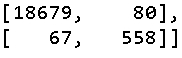
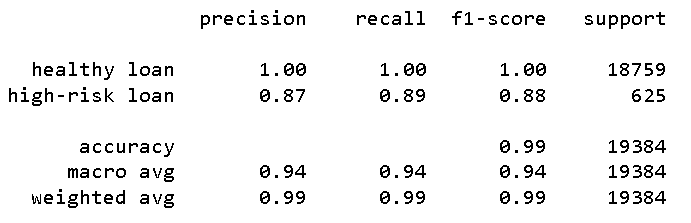
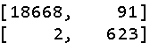
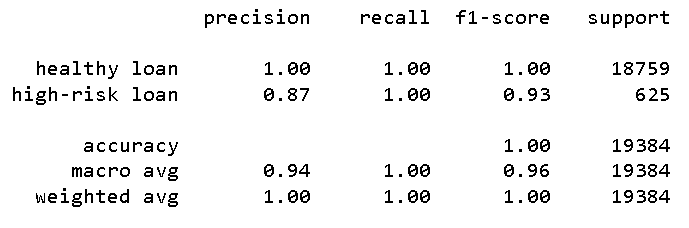

# credit-risk-classification
## Module_20 • `2023-05-10T23:53−07:00 (PDT)`

## Analysis Overview 
#### The Logistic Regression model with the `original data` has a Balanced Accuracy of 94.427%.
- It it **very good** at predicting ***healthy loans*** with only 80 inacurate predictions in 18759.

- However, it is **not very good** at predicting ***high-risk loans***, where 67 of its 625 predictions are inaccurate.

#### The Logistic Regression model with the `resampled data` on the other hand, has a Balanced Accuracy of 99.597%.
- While it is *slightly less accurate* at predicting ***healthy loans***, it is still **very good**, with only 91 inacurate predictions in 18759. However, it is **not very good** at predicting ***high-risk loans***, where 67 of its 625 predictions are inaccurate.

- It is **much better** however, at predicting ***high-risk loans***, ith only 2 of its 625 predictions inaccurate.

#### With improved accuracy, precision, and recall scores of this model, it is reccomended.